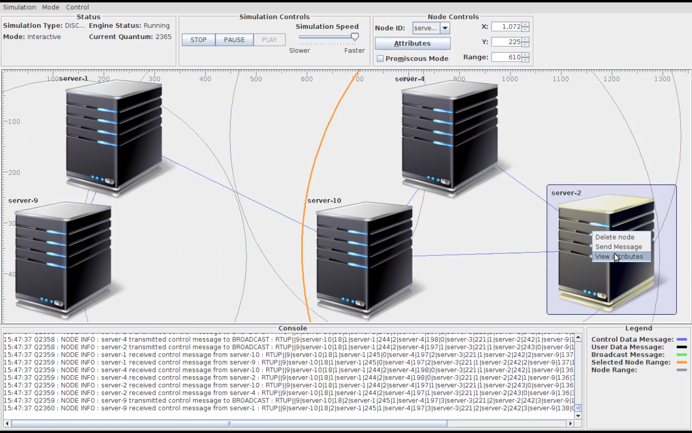

# What is the Java Server Discovery?
Server Discovery is a Java Network Simulator for ad-hoc and distributed networks. 
With Server Discovery you can create simulators easily just by clicking on a GUI. Each node represents a server instance. 
Each server then broadcasts a broadcasting message in the open air repeatedly when created. 
Every node in the simulator has a range defined that describes reachability of it, like a physical antenna. 
These are all can be configured in the simulator easily. 
In order for each node to be reachable by other nodes new routing table is created dynamically as nodes move, remove or created in the environment. 
Meanwhile the whole node in the simulator synchronously broadcasts at the same time with the latest shortest path table. 
This table helps like a map of how to reach to each node in the system. Regular text messages then can be passed to other nodes crossing each node until reach to destination.

Watch video for more information.

